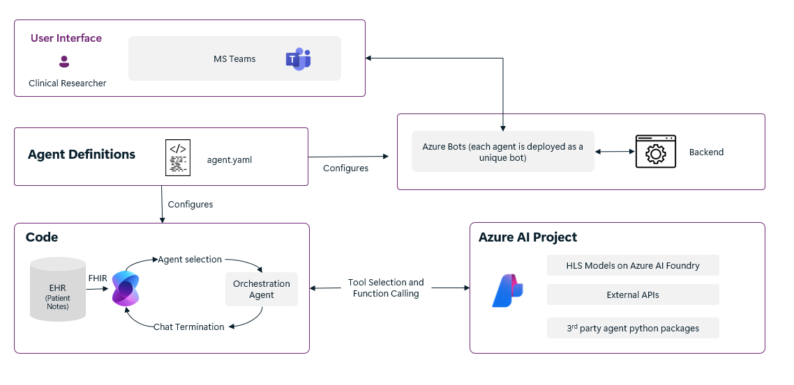
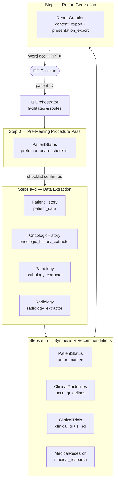
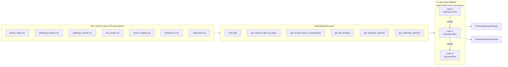
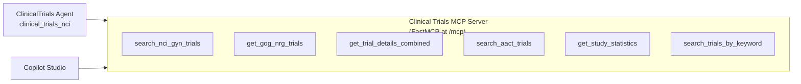

# Rush GYN Oncology Tumor Board — Agent Orchestrator

A multi-agent system that coordinates specialized AI agents to support **Gynecologic Oncology Tumor Board** case reviews at Rush University Medical Center. Built on Microsoft Semantic Kernel, the system extracts, structures, and presents patient data from Epic Clarity/Caboodle in clinical shorthand format.

> [!IMPORTANT]
> This system is intended for research and development use only. It is not designed for clinical deployment as-is and has not been validated for diagnosis or treatment decisions. Users bear sole responsibility for verifying outputs, compliance with healthcare regulations, and obtaining necessary approvals.

## Features

- **10 specialized agents** collaborating via Semantic Kernel group chat
- **Pre-meeting procedure pass** — audits required labs (CBC ≤14d, CMP ≤14d, CA-125 ≤28d), imaging (CT CAP ≤56d, MRI Pelvis ≤42d), pathology, IHC/NGS, and consults before the tumor board; surfaces outstanding items with Rush Epic order codes
- **GYN oncology-focused** extraction: pathology (histology, IHC, endometrial molecular classification), radiology (RECIST, PCI), tumor markers (CA-125 trending, GCIG criteria), oncologic history
- **3-layer note fallback** — dedicated CSV → NoteType filter → keyword filter, ensuring pathology and radiology data is recovered even for outside-hospital (OSH) transfer patients
- **NCCN guideline lookup** — Docling + PyMuPDF pipeline loads NCCN GYN PDFs; GPT-4o retrieves algorithm-relevant pages for uterine/endometrial, vaginal, and vulvar cancers (ovarian and cervical use model training knowledge)
- **Evidence-based research** — real-time PubMed, Europe PMC, and Semantic Scholar search with RISEN synthesis prompt, PubMed-first deduplication, and post-synthesis citation validation (no fabricated PMIDs)
- **Outside hospital (OSH) transfer support** — structured history extraction for the ~20–30% of patients referred from other institutions
- **Landscape 5-column Word document** matching the Rush tumor board format (Patient | Diagnosis & History | Previous Tx/Findings | Imaging | Discussion)
- **5-slide PowerPoint** summary with CA-125 trend chart (one slide per tumor board column)
- **Clinical trials search** via NCI ClinicalTrials.gov API + AACT with GOG/NRG awareness
- **MCP server** for clinical trials (6 FastMCP tools) with Copilot Studio integration
- Integration with Microsoft Teams and Copilot Studio via MCP

## Solution Architecture



Agents are defined in `agents.yaml` and orchestrated through Semantic Kernel's group chat. Each agent has access to specialized tools (SK plugins). The Orchestrator facilitates the tumor board discussion flow, calling on each agent in sequence.

### Tumor Board Workflow



### Data Layer



### MCP Integration



## AI Agent Role Summaries

| Agent | Tools | Role |
|-------|-------|------|
| **Orchestrator** | — | Facilitates tumor board discussion; routes to agents in order; step 0 triggers pre-meeting checklist |
| **PatientHistory** | `patient_data` | Loads patient record from Epic Clarity CSV, builds chronological timeline filtered to 55 relevant NoteTypes |
| **OncologicHistory** | `oncologic_history_extractor`, `patient_data` | Extracts structured prior oncologic history — diagnosis, treatments, recurrences, reason for referral. Critical for OSH transfers |
| **Pathology** | `pathology_extractor`, `patient_data` | Extracts histology, IHC panel (MMR/p53/ER/HER2), molecular markers, FIGO grade, endometrial molecular classification (POLEmut/MMRd/NSMP/p53abn) |
| **Radiology** | `radiology_extractor`, `patient_data` | Structures imaging findings from CT, MRI, PET/CT, US reports using LLM text analysis; RECIST response tracking |
| **PatientStatus** | `tumor_markers`, `pretumor_board_checklist`, `patient_data` | Step 0: pre-meeting procedure pass (labs/imaging/path/consults); then FIGO staging, molecular profile, platinum sensitivity |
| **ClinicalGuidelines** | `nccn_guidelines` | NCCN-based treatment recommendations using loaded NCCN PDFs (uterine/endometrial, vaginal, vulvar); ovarian and cervical use model training knowledge |
| **ClinicalTrials** | `clinical_trials`, `clinical_trials_nci` | Searches NCI ClinicalTrials.gov + AACT for eligible trials with GOG/NRG awareness and GYN-specific metadata |
| **MedicalResearch** | `medical_research` | Real-time PubMed/Europe PMC/Semantic Scholar search; RISEN synthesis prompt; post-synthesis citation validation |
| **ReportCreation** | `content_export`, `presentation_export` | Assembles landscape 5-column Word doc + 5-slide PPTX with CA-125 trend chart |

## Getting Started

### Prerequisites

- An Azure subscription with:
    - Azure OpenAI: 100k Tokens per Minute of Pay-as-you-go quota for GPT-4.1
    - Optionally a reasoning model such as GPT-o3 or o4-mini
    - Azure App Services: Available VM quota — P1mv3 recommended
    - A resource group where you have _Owner_ permissions
- [Azure CLI](https://learn.microsoft.com/en-us/cli/azure/install-azure-cli)
- [Azure Developer CLI](https://learn.microsoft.com/en-us/azure/developer/azure-developer-cli/install-azd?tabs=winget-windows%2Cbrew-mac%2Cscript-linux&pivots=os-linux)
- Python 3.12 or later (for running locally)
- Node.js 18+ (for PptxGenJS PowerPoint generation)
- Epic Clarity/Caboodle access (for production patient data)

### Step 1: Verify Prerequisites (Quota & Permissions)

Before deploying, verify your Azure subscription has sufficient quota.

**Resource Requirements:**

* **Azure OpenAI Quota**
  - Ensure you have quota for **GPT-4.1** (`GlobalStandard`) in your `AZURE_GPT_LOCATION` region (recommended: 100K–200K TPM)

* **App Service Capacity**
  - Verify App Service quota in your `AZURE_APPSERVICE_LOCATION` region
  - Ensure sufficient capacity for P1mv3 App Service Plan

**Required Permissions:**

* **Azure Resource Access**
  - You need **Owner** rights on at least one resource group

* **Teams Integration**
  - Ensure your IT admin allows custom Teams apps to be uploaded — see [Teams app upload](https://learn.microsoft.com/en-us/microsoftteams/platform/concepts/deploy-and-publish/apps-upload)


### Step 2: Create an `azd` Environment & Set Variables

```sh
# Log in to Azure CLI and Azure Developer CLI
az login                 # add -t <TENANT_ID> if needed
azd auth login           # add --tenant <TENANT_ID> if needed
```

Create a new environment:
```sh
azd env new <envName>
```

Configure region settings (only set values that differ from your main `AZURE_LOCATION`):

```sh
azd env set AZURE_GPT_LOCATION <gpt-region>
azd env set AZURE_APPSERVICE_LOCATION <region>
```

| Variable | Purpose | Accepted Values | Default |
|----------|---------|-----------------|---------|
| `AZURE_LOCATION` | Primary location for all resources | Azure region | Resource group region |
| `AZURE_GPT_LOCATION` | Region for GPT resources | Azure region | `AZURE_LOCATION` |
| `AZURE_APPSERVICE_LOCATION` | Region for App Service deployment | Azure region | `AZURE_LOCATION` |
| `CLINICAL_NOTES_SOURCE` | Source of clinical notes | `caboodle`, `blob`, `fhir`, `fabric` | `blob` |
| `AZURE_OPENAI_DEPLOYMENT_NAME_REASONING_MODEL` | Reasoning model deployment (required for ClinicalTrials agent) | Azure OpenAI deployment name | — |
| `AZURE_OPENAI_REASONING_MODEL_ENDPOINT` | Reasoning model endpoint (required for ClinicalTrials agent) | Azure OpenAI endpoint URL | — |
| `DEMO_ROUTES_ENABLED` | Enable demo view routes (`/view/` endpoints) | `true`, `false` | `false` |

For local development with Epic Clarity CSV exports:
```sh
azd env set CLINICAL_NOTES_SOURCE caboodle
```

For production Epic integration via Azure Health Data Services:
```sh
azd env set CLINICAL_NOTES_SOURCE fhir
```

### Step 3: Deploy the Infrastructure

> [!IMPORTANT]
> Deploying will create Azure resources and may incur costs.

```bash
azd up
```

During deployment you will be prompted for subscription, region, and resource group. Pick **User** as the principal type.

> [!TIP]
> For persistent issues, use `azd down --purge` to reset.

> [!IMPORTANT]
> Full deployment can take 20–30 minutes. See the [Troubleshooting guide](./docs/troubleshooting.md) for common issues.

### Step 4: Install Agents in Microsoft Teams

```sh
./scripts/uploadPackage.sh ./output <teamsChatId|meetingLink> [tenantId]
```

See [Teams documentation](./docs/teams.md) for details on finding chat IDs and managing agent permissions.

### Step 5: Test the Agents

```
@Orchestrator clear                  # Reset conversation state
```

Start a GYN tumor board review:
```
@Orchestrator Can you start a tumor board review for Patient ID: patient_gyn_001?
```

Interact with specific agents:
```
@PatientHistory create patient timeline for patient id patient_gyn_001
@OncologicHistory extract oncologic history for patient_gyn_001
@Pathology extract pathology findings for patient_gyn_001
@PatientStatus run pre-meeting checklist for patient_gyn_001 cancer_type ovarian
```

For local development without Azure:
```sh
cd src
CLINICAL_NOTES_SOURCE=caboodle python3 -m pytest tests/test_local_agents.py -v
```

See the [User Guide](./docs/user_guide.md) for detailed testing instructions.

### Step 6: Using the React Client Application

A chat UI is deployed alongside the backend. Access it using the URL from `azd up` output.

> [!NOTE]
> By default the app is only accessible from Microsoft 365/Teams IP ranges. Add your IP for direct access:
> ```sh
> azd env set ADDITIONAL_ALLOWED_IPS "your.ip.address/32"
> azd up
> ```

### [Optional] Uninstall / Clean-up

```sh
azd down --purge
```

## Tumor Board Output Format

### Pre-Meeting Procedure Pass

Before the tumor board review, `PatientStatus` runs a procedure pass that audits:

| Category | Items Checked | Thresholds |
|----------|--------------|------------|
| **Labs** | CBC, CMP, CA-125, (Beta-hCG, CEA, CA19-9 conditional) | CBC/CMP ≤14d · CA-125/markers ≤28d |
| **Imaging** | CT Chest/Abdomen/Pelvis, MRI Pelvis, (PET/CT conditional) | CT CAP ≤56d · MRI ≤42d |
| **Pathology** | Surgical path report, IHC (MMR/p53/ER/HER2), NGS panel, germline testing | Present (no expiry) |
| **Consults** | GYN Onc, Med Onc, Rad Onc, Genetics, (Fertility, Palliative conditional) | Note present in chart |

Each item returns ✓ current / ⚠ stale / ✗ missing, with Rush Epic order codes for any gaps.

### Word Document (Landscape 5-Column)
The ReportCreation agent generates a one-page landscape Word document with:

| Column 0 | Column 1 | Column 2 | Column 3 | Column 4 |
|----------|-----------|----------|----------|----------|
| Patient (case #, MRN, attending, RTC, location, path date) | Diagnosis & Pertinent History | Previous Tx or Operative Findings, Tumor Markers | Imaging | Discussion |

Content uses clinical shorthand (s/p, dx, bx, LN, OSH, c/w) with M/D/YY date format.
Staging and genetics (primary site, FIGO stage, germline, somatic) appear in red matching the Rush tumor board format.

### PowerPoint (5 Slides)
1. **Patient** — case logistics (case #, attending, RTC, location, path date)
2. **Diagnosis** — narrative + staging/genetics in red
3. **Previous Tx** — treatment history with native CA-125 trend chart
4. **Imaging** — dated imaging studies (CT/MRI/PET)
5. **Discussion** — review types, trial eligibility, plan

## Utility Scripts

| Script | Purpose |
|--------|---------|
| `scripts/parse_tumor_board_excel.py` | Parse tumor board Excel input into patient CSV folders |
| `scripts/nccn_pdf_processor.py` | Process NCCN GYN PDF guidelines for guideline agent |
| `scripts/validate_patient_csvs.py` | Validate patient CSV file integrity and completeness |
| `scripts/run_batch_e2e.py` | Batch end-to-end test runner across all 15+ patients |
| `scripts/generate_docx_template.py` | Generate Word template for content_export |
| `scripts/generate_pptx_template.py` | Generate PPTX template for presentation_export |
| `scripts/generate_fhir_resources.py` | Generate synthetic FHIR test data |
| `scripts/ingest_fhir_resources.py` | Ingest FHIR data into Azure Health Data Services |

## Resources

### Project Documentation

- [User Guide](./docs/user_guide.md) and [Documentation Index](docs/README.md)
- [Agent Development Guide](./docs/agent_development.md) for building and customizing agents
- [GYN Tumor Board Scenario Guide](./docs/scenarios.md)
- [Data Access & Epic Integration](./docs/data_access.md)
- [FHIR Integration](./docs/fhir_integration.md)
- [Fabric Integration](./docs/fabric/fabric_integration.md)
- [Data Ingestion Guide](./docs/data_ingestion.md) for adding patient data
- [MCP & Copilot Integration](./docs/mcp.md)
- [Network Architecture](./docs/network.md)
- [Teams Integration Guide](./docs/teams.md)

### External Documentation

- [Introduction to Semantic Kernel](https://learn.microsoft.com/en-us/semantic-kernel/overview/)
- [Azure OpenAI Service](https://learn.microsoft.com/azure/ai-services/openai/overview)
- [NCCN Guidelines — Gynecologic Cancers](https://www.nccn.org/guidelines/category_1)
- [NCI ClinicalTrials.gov API](https://clinicaltrials.gov/data-api/about-api)

## Guidance

Deployment creates:
- 1 [GPT-4.1 deployment](https://learn.microsoft.com/en-us/azure/ai-services/openai/concepts/models)
- 1 [App Service](https://learn.microsoft.com/en-us/azure/app-service/overview)
- 2 [Azure Storage accounts](https://learn.microsoft.com/en-us/azure/storage/common/storage-account-overview)
- Associated [managed identities](https://learn.microsoft.com/en-us/entra/identity/managed-identities-azure-resources/overview) and [Azure Bot](https://learn.microsoft.com/en-us/azure/bot-service/bot-service-overview?view=azure-bot-service-4.0) instances

### Security

All resources use Entra ID authentication. No passwords are stored.

- **API routes** are protected via Azure App Service EasyAuth (Entra ID). WebSocket connections require a valid `X-MS-CLIENT-PRINCIPAL-ID` header — unauthenticated clients are rejected before the connection is accepted.
- **Demo view routes** (`/view/`) for patient timeline and data-answer HTML pages are disabled by default. Enable only in development environments by setting `DEMO_ROUTES_ENABLED=true`.
- **Real patient GUIDs** must not be hardcoded in source files. For tests requiring real patient IDs, add them to `src/tests/local_patient_ids.json` (gitignored) or set the `TEST_PATIENT_GUIDS` environment variable.
- Files under `infra/patient_data/` with UUID-format folder names are gitignored and will not be committed.

## Ethical Considerations
Microsoft believes Responsible AI is a shared responsibility. While testing agents with patient data, ensure the data contains no PHI/PII and cannot be traced to a patient identity. Please see [Microsoft's Responsible AI Principles](https://www.microsoft.com/en-us/ai/principles-and-approach/).

## Contact Us

For questions or inquiries, please contact the Rush AI team.

### Issues and Support

If you encounter issues, please create a [GitHub issue](https://github.com/RushAI-jcr/rushtumorboard/issues) with details and reproduction steps.
